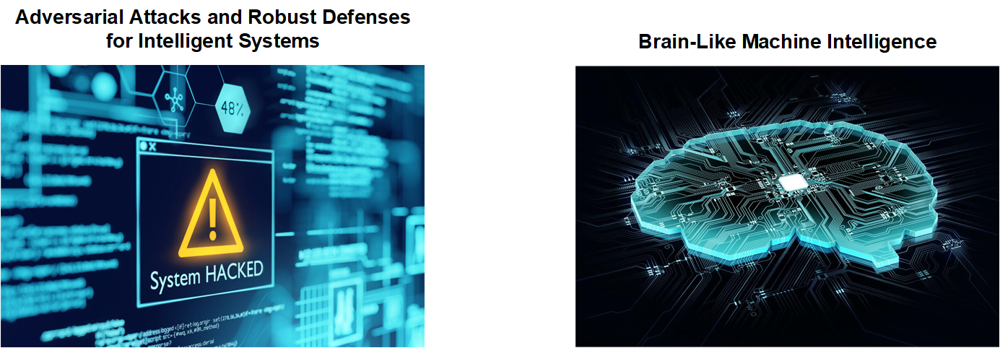

I received his PhD degree in 2019 from the School of Vehicle and Mobility, Tsinghua University, Beijing, China. 
From 2019 to 2021, he served as a Senior Researcher at Huawei Noah's Ark Lab.
I am currently a Research Fellow at Nanyang Technological University, Singapore.

My research interests lie at the intersection of machine autonomy and trustworthy AI, spanning the
entire spectrum from models and algorithms to applications in autonomous vehicles, electric vehicles,
intelligent transportation systems (ITS), and robotics, in which I have contributed over 40 papers
and hold 8 granted patents.

My vision is to build trustworthy machine intelligence and systems capable of ensuring robustness,
safety, adaptability, and cooperativeness in safety-critical tasks or complex and uncertain environments, with a special focus on applied research in intelligent vehicles and transportation systems,
as well as foundational research in models and algorithms.
  
**Adversarial Attacks and Robust Defensesfor Intelligent Systems** **Brain-Like Machine Intelligence**

